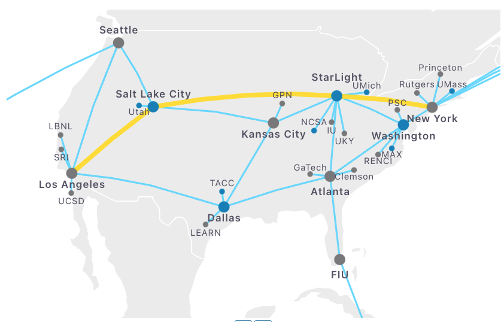
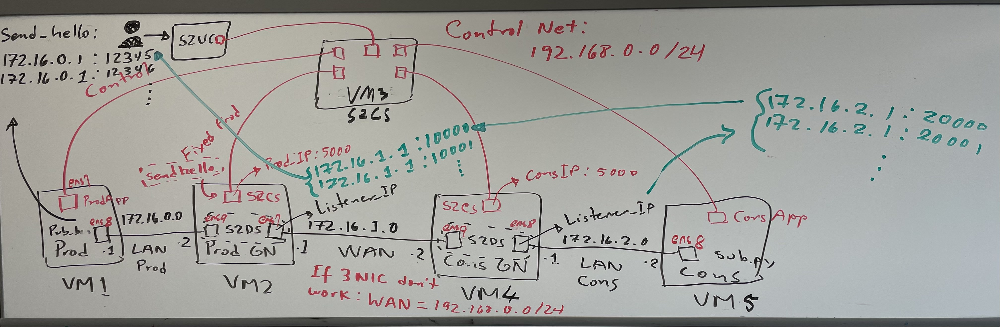

# FABRIC Experiments for SciStream

This document provide detailed FABRIC experiments for SciStream experiments. Also provide a simple proxy design for S2DS (sockmap), and a QUIC proxy solution

## 'scistream_Final...' Jupyter Notebook
You may start from this notebook first to check on how SciStream is setup on FABRIC testbed.

***Please note, FABRIC testbed is not stable, it is still under development!***

Make sure to update the credential requirements block, currently provided is as of Aug 2022. Useful resources are also provided in the jupyter notebook. Please check carefully.

## setup_files
These are the setup scripts for the environment.

|File Name                      |Usage                         |
|-------------------------------|-----------------------------|
|setup.sh            |SciStream setup and usage example            |
|setup_tcp-sockmap.sh            |sockmap proxy setup, please do mannually           |
|setup_mona_conda.sh && setup_mona.sh|Install MONA application on node, use virtual environment|
|setup_quic_proxy.sh|Install quic and quic proxy on board.|

## Supporting files
You will need those supporting files for create the QUIC proxy as well as the sockmap proxy chain.
|File Name                      |Usage                         |
|-------------------------------|-----------------------------|
|quic-go.zip           |go version QUIC, used for develop QUIC proxy code           |
|quic-proxy-example.zip           |source code for quic proxy           |
|quic-tun|A tunnel solution for using QUIC on WAN, used for comparision|
|sockmap_kern && sockmap_user.txt |sockmap proxy source code to be added in the linux kernel, please check setup_tcp-sockmap.sh file for details|

## FABRIC testbed in stage 1

## SciStream on FABRIC - Topology graph on whiteboard :)

## Contact
If you have more question, please contact: Chengyi Qu @ cqy78 at mail dot missouri dot edu, or Juaquin Chung @ chungmiranda at anl dot gov.
